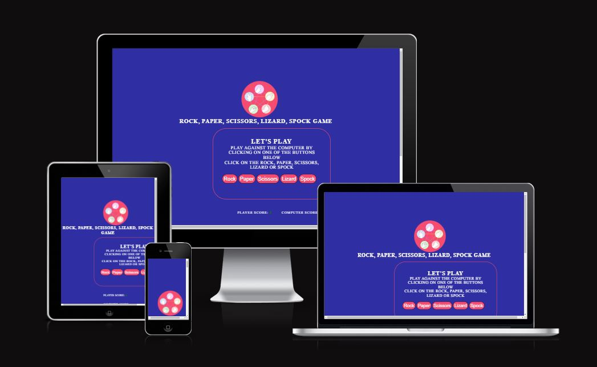
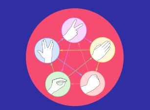
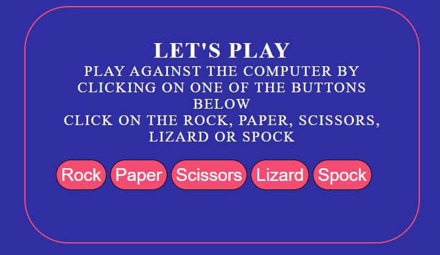
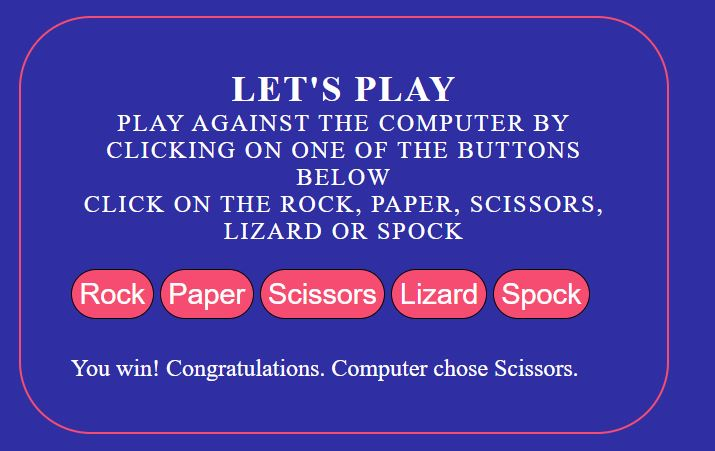
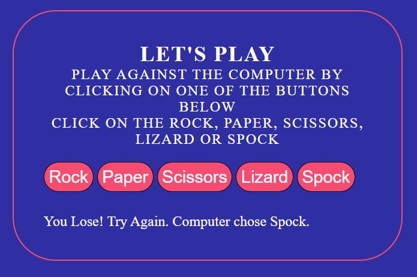
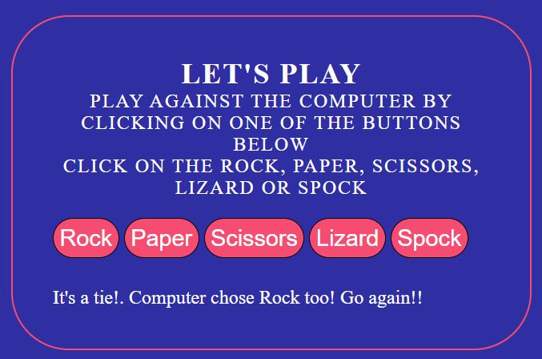
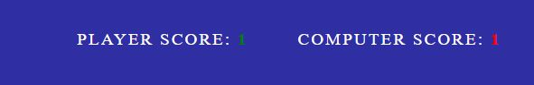
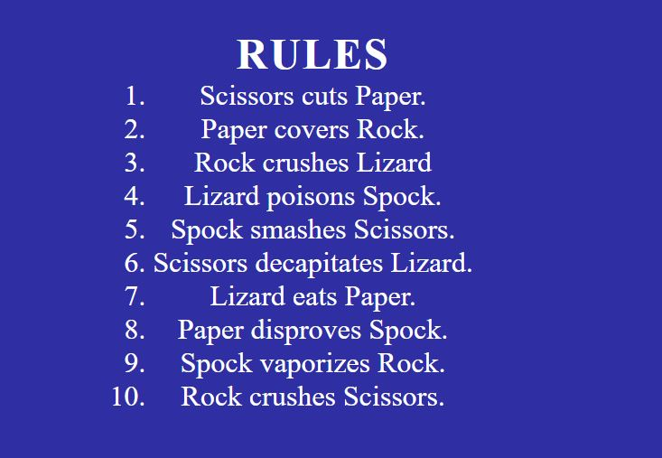

# ROCK, PAPER, SCISSORS, LIZARD, SPOCK GAME

[Rock, Paper, Scissors, Lizard, Spock game](https://conal2023.github.io/RPSLS/)

This website has been created on the Rock, Paper, Scissors, Lizard, Spock game from the TV series The Big Bang Theory. Its add two more options to choose from the original game Rock, Paper, Scissors. This websites gives the user to play against the computer 

## Purpose of the Project

Rock, Paper, Scissors, Lizard, Spock is an expanded version of the original Rock, Paper, Scissors game. The purpose of this project was to create a copy of the game that will allow users to play against the computer. 

## Features 

- **Logo**

    - Featured at the top of the page and shows what beats what. 

- **Header**

    - Featured at the top of the page, easy to read and explains what the game the player is playing. 

 

- **Game Area**

    - Here the user is presented with 5 buttons to click on. When a button is clicked the computer will come back with its choice.

- **Game Results**

    - Here once both parties picks their choices the result is displayed. There are 3 options for the results:

        - Win: here you will get a message that says "You win! Congratulations. Computer chose (*)."
        

        - Lose: here you will get a message that says "You Lose! Try Again. Computer chose (*)."
        

        - Draw: here you will get a message that says "It's a tie! Computer chose (*) too! Go again!!
        

- **Score Area** 

    - Here a record is kept of who is winning, player or computer!
    - For each win is record the score increases by 1 for that party. 

- **Reset Score** 

    - Here is a simple button to allow the game to be reset and the scores go back to zero for both. 

- **Rules Area**

    - Here the rules are displayed so the player knows what beats what. 

- **Footer**

    - Here both social links to Github and Linkedin are displayed. Both link will open in a new tab and direct you to my profiles on both. 

## Testing

- I have tested this web page on three different browsers and works on all: Chrome, Edge, and Firefox
- Device toolbar was also used to see the website through different screen sizes. 
- All buttons on the page were tested and confirmed to be working as they should. 
- Confirmed the correct results were given for all options. 

## Bugs

- When I first tried to create the Rock, Paper, Scissors, Lizard, Spock game my first try at coding didnt work. It kept giving wrong answers for Lizard and Spock. After multiple tries at fixing this I got extremely frustrated and ended up deleting both the work space on Codeanywhere and the Repo on Github. I continued to search for way to do it and after a good while looking found a solution. I was so close with the original code I now wish I didnt delete it. A lesson learnt for future projects. 

- When it came to testing at the end of the project I noticed I made a mistake with the Rules section. I had manually typed the numbers for the list when I should have coded this. From here I noticed when I went to fix this it caused issues with other areas in the project. Once i had all this fixed I then tried to test the page again and noticed that the bottom part of the list was now hidden behind the Footer. I tried multiple options but with no success so I turned to Google and found a solution which helped. 

## Validator Testing 

- HTML

    - No errors were returned when passing through the offical W3C validator.

- CSS

    - No errors were found when passing through the official (jigsaw) validator.

- JavaScript

    - No errors we found when passing through the Validator (JSHint.com)

- Accessibility 

    - From running through the lighthouse I confirmed that the colors and fonts chosen are easy to read and accessible.
    [Lighthouse](docs/screenshots/lighthouse.JPG)

## Deployment

- I deployed the page on Github by following the below steps:
    - Open the Settings tab from the menu on the left.
    - Choose the Pages tab from the menu on the left.
    - Choose the Main Branch from the drop-down option under the Source section, then clicked Save.
    - When a deployment to Github page is successful, a notice will be shown with the link to the live page. 

You can find the live site her [Rock, Paper, Scissors, Lizard, Spock](https://conal2023.github.io/RPSLS/)

## Credits 

- The Code Institute Love Running Project / Love Math Project had an impact on this project. There may be some similarities in the code but I tried to stray away as much as possible. 
- The W3Schools.com website helped a lot when I was struggling to find a way to do something. 
- Slack chats - I found some of the other students to be a great help with solutions to problems I was having or suggesting changes to the project. 

